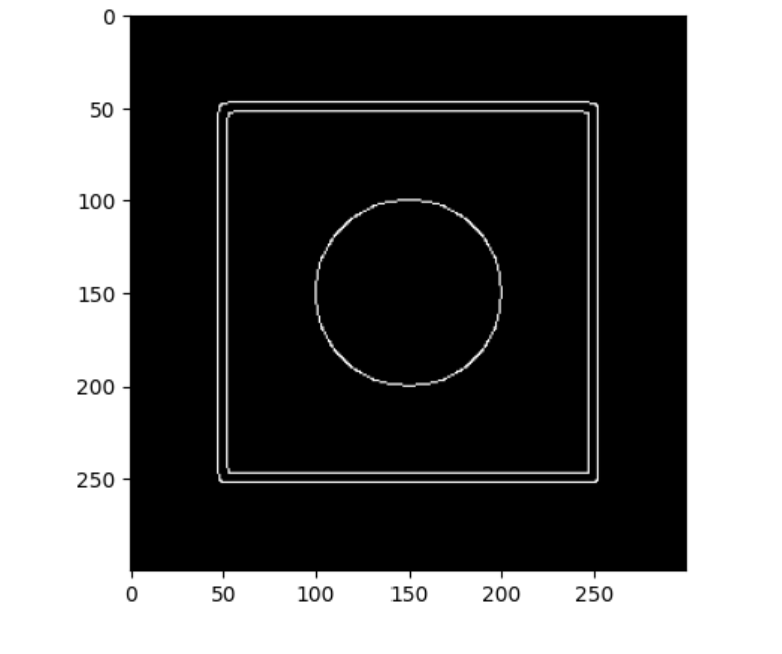

# Edge Detection Project

## Project Overview

This project demonstrates how to detect edges in images using classical computer vision techniques with Python and OpenCV. Edge detection is a fundamental step in many image processing and computer vision applications, helping to identify object boundaries, shapes, and significant transitions in images.

The main goal of this project is to apply filters like grayscale conversion, Gaussian blur, and Canny edge detection to highlight the edges in a given image, showcasing how these techniques work together to produce clean edge maps.

## Technologies & Libraries Used

- **Python**: Programming language used for implementation.
- **OpenCV**: Open source computer vision library for image processing tasks.
- **Matplotlib**: Visualization library to display images and results.
- **Jupyter Notebook**: For interactive coding and demonstration.

## How It Works

1. **Image Upload**: The user uploads an image to process.
2. **Grayscale Conversion**: The color image is converted to grayscale to simplify processing.
3. **Gaussian Blur**: The grayscale image is smoothed using a Gaussian filter to reduce noise and avoid false edge detection.
4. **Canny Edge Detection**: The blurred image is processed with the Canny edge detector, which finds areas of rapid intensity change, indicating edges.
5. **Display Results**: The detected edges are displayed using Matplotlib.

## Features

- Supports uploading custom images.
- Applies standard pre-processing steps to improve edge detection.
- Visual output of detected edges for easy verification.
- Simple and easy-to-understand code for learning purposes.

## Installation

1. Clone the repository:
    ```bash
    git clone https://github.com/yourusername/EdgeDetection.git
    cd EdgeDetection
    ```

2. Install dependencies:
    ```bash
    pip install -r requirements.txt
    ```

## Example Output

Below is an example of edge detection on a sample image:



## Why Edge Detection?

Edge detection helps machines understand the structure and content of images by identifying significant boundaries. This is widely used in:

- Object detection and recognition
- Image segmentation
- Computer vision tasks in robotics, medical imaging, and surveillance


## Future Improvements

- Add support for other edge detection methods like Sobel or Laplacian filters.
- Integrate real-time edge detection from webcam feed.
- Implement threshold tuning for better control over detection sensitivity.


## Usage

To run the edge detection demo, open the Jupyter Notebook:

```bash
colab notebook EdgeDetection.ipynb


